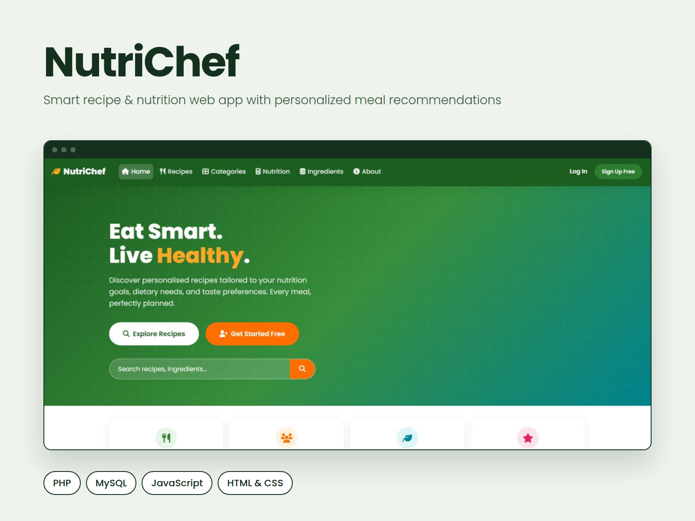
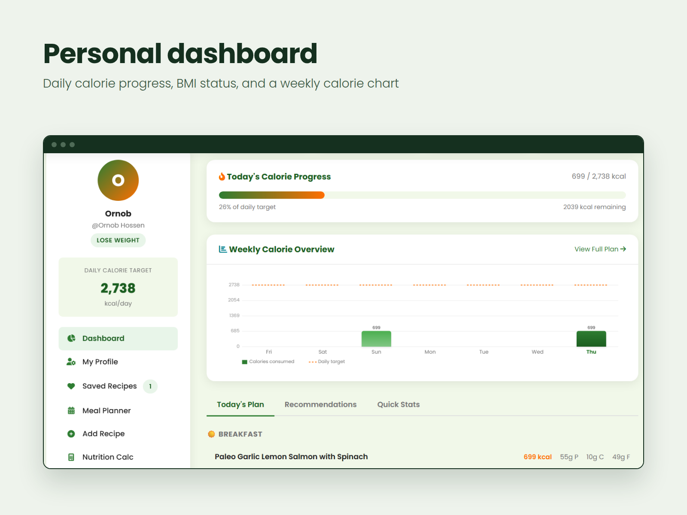
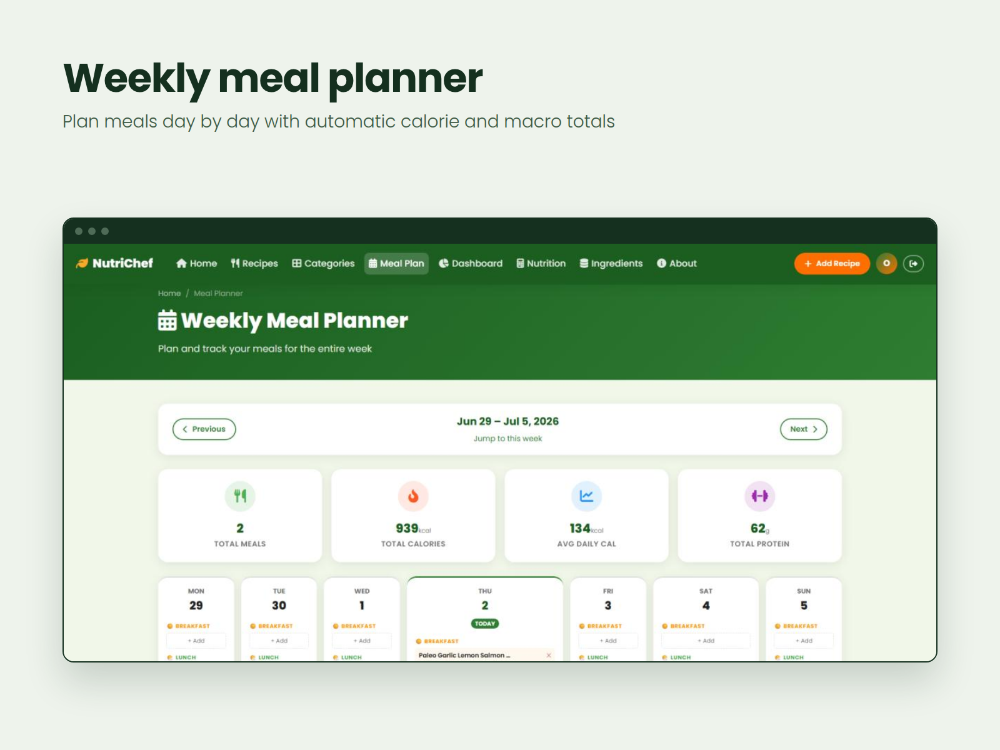
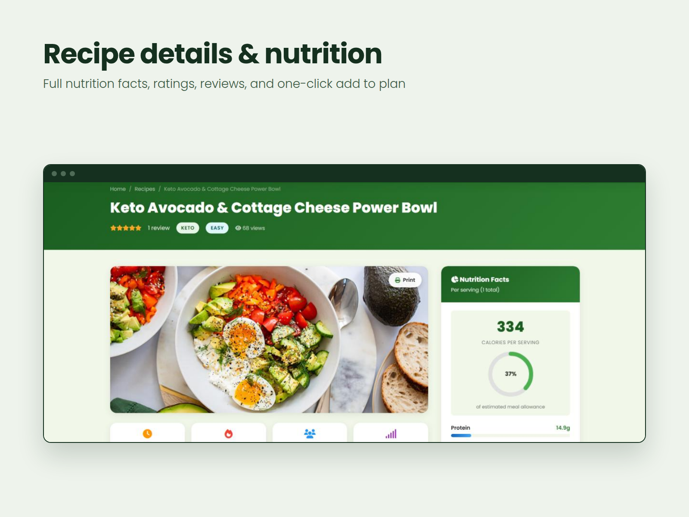
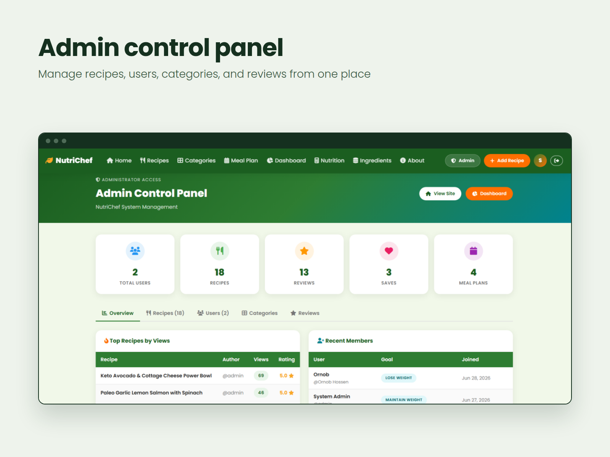

# NutriChef – Smart Recipe & Nutrition Web App

NutriChef is a full-stack web application that recommends recipes based on each user's personal profile: age, weight, height, activity level, dietary preference, and fitness goal. It calculates a personalized daily calorie target using the **Mifflin-St Jeor equation** and helps users plan meals, track calories, and explore the nutrition of every recipe.



## Features

**For users**
- Registration and login with secure password hashing (bcrypt)
- Personalized daily calorie target (TDEE) and BMI status
- Recipe recommendations filtered by diet (Vegan, Keto, Paleo, Gluten-Free and more) and goal
- Personal dashboard with daily calorie progress and a weekly calorie chart
- Weekly meal planner with automatic calorie and macro totals
- Nutrition calculator and ingredient nutrition database
- Recipe search and filters (category, difficulty, calories, and more)
- Full nutrition facts for every recipe: calories, protein, carbs, fat, fiber, sugar, sodium
- Save favorite recipes, rate and review recipes
- Add your own recipes with photos
- Profile management, including goals, lifestyle, and password changes

**For admins**
- Admin dashboard with site statistics
- Manage recipes, users, categories, and reviews

## Screenshots

| Dashboard | Meal Planner |
|---|---|
|  |  |

| Recipe Details | Admin Panel |
|---|---|
|  |  |

## Tech Stack

- **Backend:** PHP 8 with PDO
- **Database:** MySQL
- **Frontend:** HTML5, CSS3, vanilla JavaScript (dynamic charts, AJAX search, responsive navigation)
- **Security:** bcrypt password hashing, parameterized SQL queries, session-based access control on protected pages

## Getting Started

### Requirements
- XAMPP (or any Apache + PHP 8 + MySQL setup)
- A modern web browser

### Installation

1. **Clone the repository** into your XAMPP `htdocs` folder:
   ```bash
   cd C:\xampp\htdocs
   git clone https://github.com/Omer-Hussien/nutrichef.git
   ```
2. **Start Apache and MySQL** from the XAMPP Control Panel.
3. **Create the database:**
   - Open `http://localhost/phpmyadmin`
   - Create a new database named `smart_recipe_db`
   - Open the **Import** tab and import `database.sql` from the project folder
4. **Check the site URL:** in `includes/config.php`, make sure `SITE_URL` matches your folder name, for example:
   ```php
   define('SITE_URL', 'http://localhost/nutrichef');
   ```
5. **Open the app** at `http://localhost/nutrichef`

### Troubleshooting
- **Page shows raw code or no styling:** run the app through Apache (`http://localhost/...`), not by opening `index.php` directly.
- **CSS not loading:** check that `SITE_URL` in `includes/config.php` matches your folder name.
- **Recipe images missing:** images for new recipes must be placed in the `images` folder.

## About

Built as a web technology course project at Multimedia University (2026). I developed the entire application: frontend, backend, and database.
